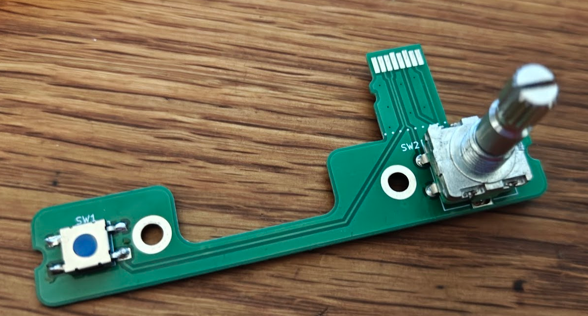

# Guition piggyback
Small add-on pcb that hooks to the SD card slot of Guition ESP32-S3-4848S040 development board to create a simulated standby flight instrument.

Inspired by [CC_G5 project by Chris Crawford](https://github.com/ccrawford/CC_G5), makes it possible to add an encoder and power button to the Guition development board without soldering.

## GPIO Pin Assignments 

The Guition development board uses four GPIO pins for the MicroSD card reader, that can be used for the simulated G5 functions.

| MobiFlight Device | GPIO |
|-------------------|------|
| Power button | GPIO 42 |
| Encoder button | GPIO 47 |
| Encoder A Pin | GPIO 48 |
| Encoder B Pin | GPIO 41 |
